# Diagram przepływu autentykacji SmartWydatki

## Opis komponentów
Poniższy diagram przedstawia przepływ operacji autentykacji w aplikacji SmartWydatki, zgodnie z wymaganiami PRD i specyfikacją modułu autentykacji. Diagram uwzględnia:

1. Layouty i komponenty frontendowe
2. Endpointy API
3. Integrację z Supabase Auth
4. Przepływ danych pomiędzy komponentami
5. Middleware autentykacji
6. Walidację danych

## Diagram Mermaid

```mermaid
flowchart TD
    %% Definicje stylów
    classDef frontendLayout fill:#d9f2d9,stroke:#5ca15c
    classDef frontendPage fill:#b3e6b3,stroke:#2e8b57
    classDef frontendComponent fill:#a3d6a3,stroke:#228b22
    classDef apiEndpoint fill:#ffcccc,stroke:#cc0000
    classDef supabaseAuth fill:#cce5ff,stroke:#0066cc
    classDef middleware fill:#f2d9e6,stroke:#cc3399
    classDef validationLayer fill:#ffffcc,stroke:#999900
    classDef dto fill:#e6ccff,stroke:#6600cc
    classDef composable fill:#ffe6cc,stroke:#cc6600

    %% Główne layouty
    BaseNonAuth["BaseNonAuth\n(Layout niezalogowany)"]:::frontendLayout
    BaseAuth["BaseAuth\n(Layout zalogowany)"]:::frontendLayout

    %% Strony
    Register["Strona Rejestracji\n/register"]:::frontendPage
    Login["Strona Logowania\n/login"]:::frontendPage
    Onboarding["Strona Onboardingu\n/onboarding"]:::frontendPage
    Settings["Ustawienia Konta\n/settings/account"]:::frontendPage
    Dashboard["Dashboard\n/dashboard"]:::frontendPage

    %% Komponenty formularzy
    FormInput["FormInput"]:::frontendComponent
    PasswordInput["PasswordInput"]:::frontendComponent
    ButtonPrimary["ButtonPrimary"]:::frontendComponent
    ValidationMessage["ValidationMessage"]:::frontendComponent
    FlashMessage["FlashMessage"]:::frontendComponent
    CategoriesList["CategoriesList"]:::frontendComponent

    %% API Endpoints
    AuthRegister["POST /api/auth/register"]:::apiEndpoint
    AuthLogin["POST /api/auth/login"]:::apiEndpoint
    AuthLogout["POST /api/auth/logout"]:::apiEndpoint
    AuthPasswordChange["POST /api/auth/password/change"]:::apiEndpoint
    AuthAccountDelete["DELETE /api/auth/account"]:::apiEndpoint
    CategoriesSuggestions["GET /api/categories/suggestions"]:::apiEndpoint
    CategoriesInitial["POST /api/categories/initial"]:::apiEndpoint

    %% Supabase Auth
    SupabaseAuth["Supabase Auth"]:::supabaseAuth
    SupabaseSignUp["sign_up()"]:::supabaseAuth
    SupabaseSignIn["sign_in()"]:::supabaseAuth
    SupabaseSignOut["sign_out()"]:::supabaseAuth
    SupabaseUpdate["update()"]:::supabaseAuth
    SupabaseDeleteUser["delete_user()"]:::supabaseAuth

    %% Middleware
    AuthMiddleware["Authentication Middleware\n@app.before_request"]:::middleware
    RequiresAuth["@requires_auth Decorator"]:::middleware
    RouterGuard["Vue Router Guard\nbeforeEach()"]:::middleware

    %% Walidacja
    ClientValidation["Walidacja kliencka\nJS + HTML5"]:::validationLayer
    ServerValidation["Walidacja serwerowa\nFlask-Inputs/Cerberus"]:::validationLayer
    ErrorHandler["Global Error Handler\n@app.errorhandler"]:::validationLayer

    %% DTO Models
    AuthRegisterInput["AuthRegisterInput\n{email, password, passwordConfirm}"]:::dto
    AuthLoginInput["AuthLoginInput\n{email, password}"]:::dto
    AuthChangePasswordInput["AuthChangePasswordInput\n{currentPassword, newPassword, passwordConfirm}"]:::dto
    InitialCategoriesInput["InitialCategoriesInput\n{categoryIds[]}"]:::dto

    %% Composables
    UseAuth["useAuth()\nComposable"]:::composable
    UseApi["useApi()\nComposable"]:::composable

    %% Połączenia layoutów z stronami
    BaseNonAuth --> Register
    BaseNonAuth --> Login
    BaseAuth --> Onboarding
    BaseAuth --> Settings
    BaseAuth --> Dashboard

    %% Połączenia stron z komponentami
    Register -.-> FormInput
    Register -.-> PasswordInput
    Register -.-> ButtonPrimary
    Register -.-> ValidationMessage
    
    Login -.-> FormInput
    Login -.-> PasswordInput
    Login -.-> ButtonPrimary
    Login -.-> ValidationMessage
    
    Settings -.-> FormInput
    Settings -.-> PasswordInput
    Settings -.-> ButtonPrimary
    Settings -.-> ValidationMessage
    
    Onboarding -.-> CategoriesList
    Onboarding -.-> ButtonPrimary

    %% Przepływ rejestracji
    Register --"1. Wypełnienie formularza"--> ClientValidation
    ClientValidation --"2. Walidacja pól"--> AuthRegisterInput
    AuthRegisterInput --"3. HTTP POST"--> AuthRegister
    AuthRegister --"4. Walidacja danych"--> ServerValidation
    ServerValidation --"5. Wywołanie API"--> SupabaseSignUp
    SupabaseSignUp --"6. Utworzenie konta"--> SupabaseAuth
    SupabaseAuth --"7. Token JWT"--> AuthRegister
    AuthRegister --"8. Przekierowanie"--> Onboarding

    %% Przepływ logowania
    Login --"1. Wypełnienie formularza"--> ClientValidation
    ClientValidation --"2. Walidacja pól"--> AuthLoginInput
    AuthLoginInput --"3. HTTP POST"--> AuthLogin
    AuthLogin --"4. Walidacja danych"--> ServerValidation
    ServerValidation --"5. Wywołanie API"--> SupabaseSignIn
    SupabaseSignIn --"6. Weryfikacja danych"--> SupabaseAuth
    SupabaseAuth --"7. Token JWT"--> AuthLogin
    AuthLogin --"8. Cookie + przekierowanie"--> Dashboard

    %% Przepływ wylogowania
    BaseAuth --"1. Kliknięcie Wyloguj"--> AuthLogout
    AuthLogout --"2. Wywołanie API"--> SupabaseSignOut
    SupabaseSignOut --"3. Wylogowanie"--> SupabaseAuth
    SupabaseAuth --"4. Usunięcie sesji"--> AuthLogout
    AuthLogout --"5. Przekierowanie"--> Login

    %% Przepływ zmiany hasła
    Settings --"1. Wypełnienie formularza"--> ClientValidation
    ClientValidation --"2. Walidacja pól"--> AuthChangePasswordInput
    AuthChangePasswordInput --"3. HTTP POST"--> AuthPasswordChange
    AuthPasswordChange --"4. Weryfikacja obecnego hasła"--> ServerValidation
    ServerValidation --"5. Wywołanie API"--> SupabaseUpdate
    SupabaseUpdate --"6. Zmiana hasła"--> SupabaseAuth
    SupabaseAuth --"7. Potwierdzenie"--> FlashMessage

    %% Przepływ usunięcia konta
    Settings --"1. Kliknięcie Usuń Konto"--> AuthAccountDelete
    AuthAccountDelete --"2. Potwierdzenie"--> SupabaseDeleteUser
    SupabaseDeleteUser --"3. Usunięcie danych"--> SupabaseAuth
    SupabaseAuth --"4. Kaskadowe usunięcie"--> AuthAccountDelete
    AuthAccountDelete --"5. Przekierowanie"--> Login

    %% Przepływ onboardingu
    Onboarding --"1. Wczytanie strony"--> CategoriesSuggestions
    CategoriesSuggestions --"2. Pobieranie sugestii"--> SupabaseAuth
    SupabaseAuth --"3. Dane kategorii"--> CategoriesList
    CategoriesList --"4. Wybór kategorii"--> InitialCategoriesInput
    InitialCategoriesInput --"5. HTTP POST"--> CategoriesInitial
    CategoriesInitial --"6. Zapisanie kategorii"--> SupabaseAuth
    SupabaseAuth --"7. Potwierdzenie"--> Dashboard

    %% Middleware i zabezpieczenia
    RouterGuard -.-> BaseAuth
    AuthMiddleware -.-> AuthRegister
    AuthMiddleware -.-> AuthLogin
    AuthMiddleware -.-> AuthLogout
    AuthMiddleware -.-> AuthPasswordChange
    AuthMiddleware -.-> AuthAccountDelete
    AuthMiddleware -.-> CategoriesSuggestions
    AuthMiddleware -.-> CategoriesInitial
    
    RequiresAuth -.-> Dashboard
    RequiresAuth -.-> Settings
    RequiresAuth -.-> Onboarding
    
    ErrorHandler -.-> FlashMessage

    %% Composables
    UseAuth --> UseApi
    UseApi -.-> AuthRegister
    UseApi -.-> AuthLogin
    UseApi -.-> AuthLogout
    UseApi -.-> AuthPasswordChange
    UseApi -.-> AuthAccountDelete
    UseApi -.-> CategoriesSuggestions
    UseApi -.-> CategoriesInitial
``` 

