# Diagram Architektury Modułu Autentykacji

<architecture_analysis>
## Analiza architektury modułu autentykacji

### Komponenty wymienione w dokumentacji:
1. **Layouty**:
   - `BaseNonAuth` - layout dla niezalogowanych użytkowników
   - `BaseAuth` - layout dla zalogowanych użytkowników

2. **Strony**:
   - `/register` - strona rejestracji
   - `/login` - strona logowania
   - `/onboarding` - ekran wyboru początkowych kategorii
   - `/settings/account` - strona ustawień konta

3. **Komponenty formularzy**:
   - `FormInput` - uniwersalny input
   - `PasswordInput` - rozszerzenie FormInput dla haseł
   - `ButtonPrimary`/`ButtonSecondary` - przyciski
   - `ValidationMessage` - komunikaty walidacji
   - `FlashMessage` - globalne komunikaty

4. **Szablony Jinja2**:
   - `register.html`, `login.html` - dziedziczą po BaseNonAuth
   - `settings_account.html` - dziedziczy po BaseAuth

5. **Endpointy API**:
   - `POST /api/auth/register` - rejestracja użytkownika
   - `POST /api/auth/login` - logowanie
   - `POST /api/auth/logout` - wylogowanie
   - `POST /api/auth/password/change` - zmiana hasła
   - `DELETE /api/auth/account` - usunięcie konta
   - `GET /api/categories/suggestions` - pobranie sugestii kategorii
   - `POST /api/categories/initial` - zapisanie początkowych kategorii

6. **Modele DTO**:
   - `AuthRegisterInput`
   - `AuthLoginInput`
   - `AuthChangePasswordInput`
   - `InitialCategoriesInput`

7. **Integracja Supabase Auth**:
   - Konfiguracja klienta Supabase
   - Implementacja operacji auth w kontrolerach
   - Proces onboardingu

8. **Composables Vue**:
   - `useAuth` - zarządzanie stanem autentykacji
   - `useApi` - wykonywanie zapytań API z tokenem auth

### Główne przepływy danych:
1. **Rejestracja**: 
   - Formularz (register.html) → walidacja → POST /api/auth/register → Supabase Auth sign_up → przekierowanie do onboardingu

2. **Logowanie**:
   - Formularz (login.html) → walidacja → POST /api/auth/login → Supabase Auth sign_in → ustawienie cookie sesji → przekierowanie do dashboardu

3. **Onboarding po rejestracji**:
   - GET /api/categories/suggestions → wybór kategorii → POST /api/categories/initial → przekierowanie do dashboardu

4. **Zmiana hasła**:
   - Formularz (settings_account.html) → walidacja → POST /api/auth/password/change → Supabase Auth update → komunikat sukcesu

5. **Usunięcie konta**:
   - Potwierdzenie → DELETE /api/auth/account → Supabase Auth delete_user → wylogowanie → przekierowanie do logowania

```mermaid
flowchart TD
    %% Główne layouty
    subgraph "Layouty"
        BaseNonAuth["BaseNonAuth\n(layout niezalogowany)"]
        BaseAuth["BaseAuth\n(layout zalogowany)"]
    end

    %% Strony
    subgraph "Strony"
        Register["Strona Rejestracji\n/register"]
        Login["Strona Logowania\n/login"]
        Onboarding["Strona Onboardingu\n/onboarding"]
        Settings["Ustawienia Konta\n/settings/account"]
    end

    %% Komponenty formularzy
    subgraph "Komponenty Formularzy"
        FormInput["FormInput"]
        PasswordInput["PasswordInput"]
        ButtonPrimary["ButtonPrimary"]
        ValidationMessage["ValidationMessage"]
        FlashMessage["FlashMessage"]
        CategoriesSuggestionsList["CategoriesSuggestionsList"]
    end

    %% API Endpoints
    subgraph "API Endpoints"
        AuthRegister["POST /api/auth/register"]
        AuthLogin["POST /api/auth/login"]
        AuthLogout["POST /api/auth/logout"]
        AuthPasswordChange["POST /api/auth/password/change"]
        AuthAccountDelete["DELETE /api/auth/account"]
        CategoriesSuggestions["GET /api/categories/suggestions"]
        CategoriesInitial["POST /api/categories/initial"]
    end

    %% Backend Services
    subgraph "Supabase Auth"
        SupabaseAuth["Supabase Auth API"]
        SupabaseSignUp["sign_up()"]
        SupabaseSignIn["sign_in()"]
        SupabaseSignOut["sign_out()"]
        SupabaseUpdate["update()"]
        SupabaseDeleteUser["delete_user()"]
    end

    %% Composables Vue
    subgraph "Composables"
        UseAuth["useAuth()"]
        UseApi["useApi()"]
        UseOnboarding["useOnboardingSuggestions()"]
    end

    %% Modele DTO
    subgraph "Modele DTO"
        AuthRegisterInput["AuthRegisterInput"]
        AuthLoginInput["AuthLoginInput"]
        AuthChangePasswordInput["AuthChangePasswordInput"]
        InitialCategoriesInput["InitialCategoriesInput"]
    end

    %% Relacje Layout-Strony
    BaseNonAuth --> Register
    BaseNonAuth --> Login
    BaseAuth --> Onboarding
    BaseAuth --> Settings

    %% Relacje Strony-Komponenty
    Register -.-> FormInput
    Register -.-> PasswordInput
    Register -.-> ButtonPrimary
    Register -.-> ValidationMessage
    Register -.-> FlashMessage
    
    Login -.-> FormInput
    Login -.-> PasswordInput
    Login -.-> ButtonPrimary
    Login -.-> ValidationMessage
    Login -.-> FlashMessage
    
    Onboarding -.-> CategoriesSuggestionsList
    Onboarding -.-> ButtonPrimary
    
    Settings -.-> FormInput
    Settings -.-> PasswordInput
    Settings -.-> ButtonPrimary
    Settings -.-> ValidationMessage
    Settings -.-> FlashMessage

    %% Przepływy logiczne - Rejestracja
    Register --"1. Wysyła dane"--> AuthRegisterInput
    AuthRegisterInput --"2. Walidacja"--> AuthRegister
    AuthRegister --"3. Wywołuje"--> SupabaseSignUp
    SupabaseSignUp --"4. Przekierowanie"--> Onboarding

    %% Przepływy logiczne - Logowanie
    Login --"1. Wysyła dane"--> AuthLoginInput
    AuthLoginInput --"2. Walidacja"--> AuthLogin
    AuthLogin --"3. Wywołuje"--> SupabaseSignIn
    SupabaseSignIn --"4. Token JWT"--> UseAuth
    UseAuth --"5. Zapisuje token"--> BaseAuth

    %% Przepływy logiczne - Onboarding
    Onboarding --"1. Pobiera sugestie"--> CategoriesSuggestions
    CategoriesSuggestions --"2. Propozycje AI"--> CategoriesSuggestionsList
    CategoriesSuggestionsList --"3. Wybór kategorii"--> InitialCategoriesInput
    InitialCategoriesInput --"4. Zapisuje wybór"--> CategoriesInitial

    %% Przepływy logiczne - Ustawienia konta
    Settings --"1. Zmiana hasła"--> AuthChangePasswordInput
    AuthChangePasswordInput --"2. Walidacja"--> AuthPasswordChange
    AuthPasswordChange --"3. Wywołuje"--> SupabaseUpdate
    
    Settings --"1. Usuń konto"--> AuthAccountDelete
    AuthAccountDelete --"2. Wywołuje"--> SupabaseDeleteUser
    SupabaseDeleteUser --"3. Wylogowanie"--> AuthLogout
    AuthLogout --"4. Przekierowanie"--> Login

    %% Integracja Composables
    UseAuth --"Dostarcza token"--> UseApi
    UseApi --"Wykonuje autoryzowane zapytania"--> AuthRegister
    UseApi --"Wykonuje autoryzowane zapytania"--> AuthLogin
    UseApi --"Wykonuje autoryzowane zapytania"--> AuthLogout
    UseApi --"Wykonuje autoryzowane zapytania"--> AuthPasswordChange
    UseApi --"Wykonuje autoryzowane zapytania"--> AuthAccountDelete
    UseApi --"Wykonuje autoryzowane zapytania"--> CategoriesSuggestions
    UseApi --"Wykonuje autoryzowane zapytania"--> CategoriesInitial
    
    UseOnboarding --"Zarządza sugestiami"--> CategoriesSuggestionsList

    %% Połączenia Supabase
    SupabaseAuth --> SupabaseSignUp
    SupabaseAuth --> SupabaseSignIn
    SupabaseAuth --> SupabaseSignOut
    SupabaseAuth --> SupabaseUpdate
    SupabaseAuth --> SupabaseDeleteUser

    %% Style dla różnych typów komponentów
    classDef layout fill:#e1f5fe,stroke:#01579b,stroke-width:2px;
    classDef page fill:#e8f5e9,stroke:#2e7d32,stroke-width:2px;
    classDef component fill:#f3e5f5,stroke:#6a1b9a,stroke-width:2px;
    classDef api fill:#fff3e0,stroke:#e65100,stroke-width:2px;
    classDef supabase fill:#ffebee,stroke:#b71c1c,stroke-width:2px;
    classDef composable fill:#e0f7fa,stroke:#00838f,stroke-width:2px;
    classDef dto fill:#f1f8e9,stroke:#558b2f,stroke-width:2px;

    class BaseNonAuth,BaseAuth layout;
    class Register,Login,Onboarding,Settings page;
    class FormInput,PasswordInput,ButtonPrimary,ValidationMessage,FlashMessage,CategoriesSuggestionsList component;
    class AuthRegister,AuthLogin,AuthLogout,AuthPasswordChange,AuthAccountDelete,CategoriesSuggestions,CategoriesInitial api;
    class SupabaseAuth,SupabaseSignUp,SupabaseSignIn,SupabaseSignOut,SupabaseUpdate,SupabaseDeleteUser supabase;
    class UseAuth,UseApi,UseOnboarding composable;
    class AuthRegisterInput,AuthLoginInput,AuthChangePasswordInput,InitialCategoriesInput dto;
```

</architecture_analysis>

<mermaid_diagram>

</mermaid_diagram> 